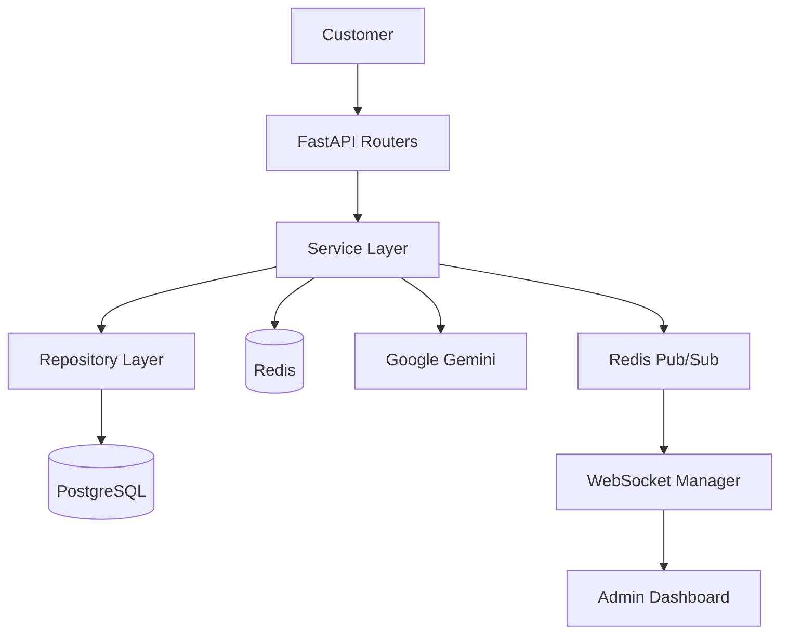
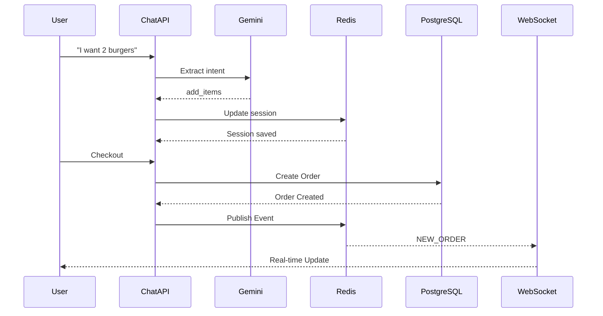

# Architecture

## Overview

AI Order System is a layered backend architecture designed to separate concerns between API handling, business logic, data persistence, and external integrations.

The system enables AI-powered restaurant ordering using FastAPI, PostgreSQL, Redis, WebSockets, and Google Gemini.

This architecture improves:

- Maintainability
- Scalability
- Testability
- Separation of concerns

---

## High-Level Architecture

---

## Infrastructure Components

- **Redis** – Session storage
- **Redis Pub/Sub** – Event system
- **WebSockets** – Real-time updates
- **Google Gemini** – AI processing

---

## Layer Responsibilities

### Routers (API Layer)

Responsible for exposing HTTP and WebSocket endpoints.

- Request validation  
- Dependency injection  
- Authentication checks  
- Response formatting  

Examples:

- `auth.py`  
- `users.py`  
- `products.py`  
- `orders.py`  
- `chat.py`  
- `dashboard.py`  
- `websockets/`  

### Services (Business Logic Layer)

Contains all core business rules and application logic.

- Chat ordering logic  
- Order creation workflow  
- Product resolution  
- Dashboard aggregation logic  
- Authentication handling  

### Repositories (Data Access Layer)

Direct interaction with PostgreSQL.

- SQL queries  
- CRUD operations  
- Data persistence  
- Data retrieval  

### Database (PostgreSQL)

Stores all persistent application data:

- Users  
- Products  
- Orders  
- Order Items  

### Redis (Cache & State Layer)

Used for:

- Chat session storage (stateful conversations)  
- Session TTL management  
- Temporary cart data  
- Event publishing (Pub/Sub)  

### WebSockets (Real-time Layer)

Pushes real-time order updates to connected clients.

- New order created  
- Order status updates  

Powered by Redis Pub/Sub for scalability.

### Google Gemini (AI Layer)

Used for natural language understanding.

- Convert user messages into structured intents  
- Extract product orders from text  
- Assist chat-based ordering flow  

---

## Architecture Flow (Chat Example)

---

## Summary

This system is designed as a production-style backend architecture demonstrating:

- Clean layered design  
- AI integration  
- Real-time event system  
- Stateful chat sessions  
- Scalable backend structure  
