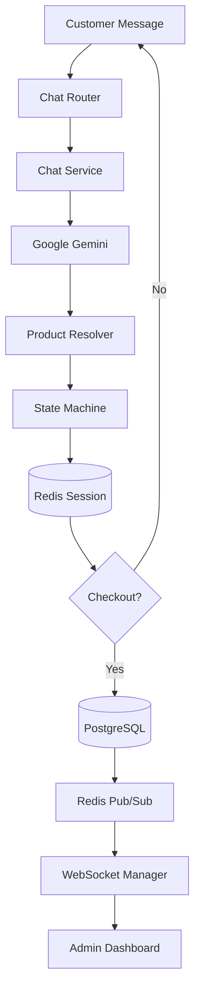
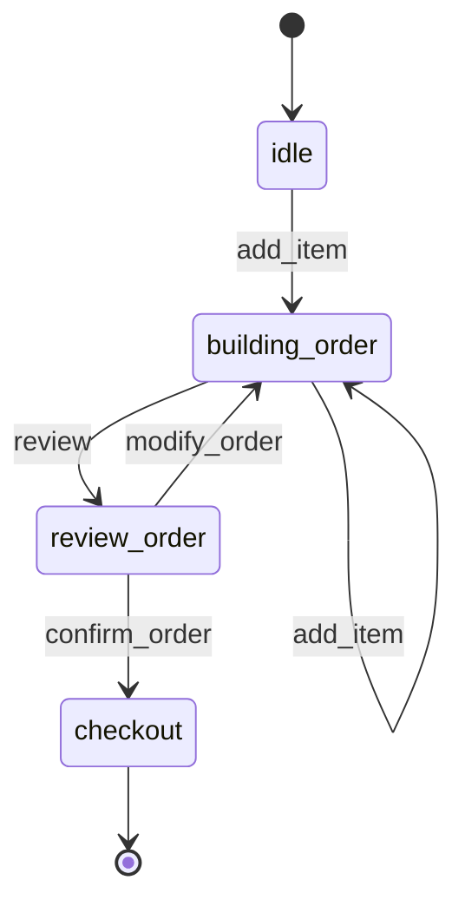
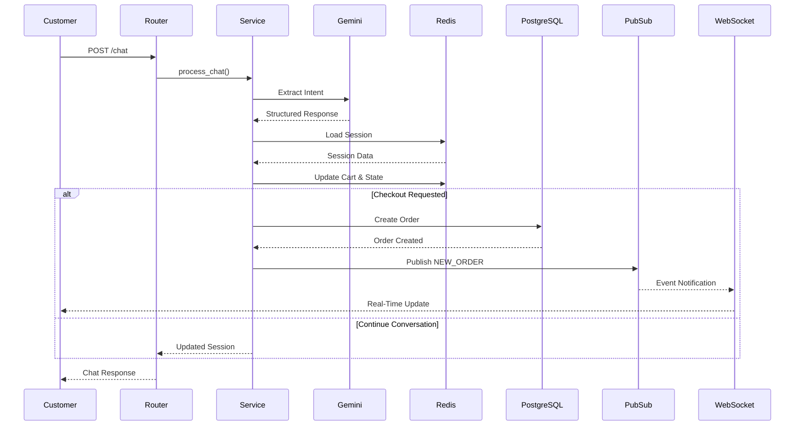

# Chat Flow Architecture

## Overview

This document explains how the AI-powered ordering system processes customer messages from initial request to final order creation.

The chat workflow combines:

- FastAPI
- Google Gemini
- Redis Sessions
- State Machine Logic
- PostgreSQL Persistence
- Redis Pub/Sub
- WebSocket Notifications

Together, these components enable a conversational ordering experience while maintaining state, consistency, and real-time updates.

---

## High-Level Flow



---

## Core Components

### 1. Chat Router

Endpoint:

```text
POST /api/v1/chat/
```

Responsibilities:

- Receive customer messages
- Validate request schema
- Load database session
- Invoke chat service
- Return formatted responses

---

### 2. Chat Service

The Chat Service acts as the orchestration layer of the entire ordering system.

Responsibilities:

- Send user message to Gemini
- Parse structured AI response
- Resolve products from database
- Update Redis session
- Execute state transitions
- Trigger checkout process when required

---

### 3. Gemini AI

Gemini converts natural language into structured order intents.

Example:

```json
{
  "intent": "add_item",
  "items": [
    {
      "product_name": "pizza",
      "quantity": 2
    }
  ]
}
```

Responsibilities:

- Intent extraction
- Product extraction
- User input normalization
- Conversation understanding

---

### 4. Product Resolver

Converts AI-generated product names into real database products.

Responsibilities:

- Product matching
- Availability validation
- Price retrieval
- Product ID resolution

Example:

```text
"2 pizzas"
        ↓
Product Resolver
        ↓
Product ID: 7
Price: 12.50
```

---

### 5. Chat State Machine

The ordering process is controlled using a state machine stored in Redis.

Supported states:

- idle
- building_order
- review_order
- checkout

Responsibilities:

- Track conversation progress
- Prevent invalid transitions
- Maintain shopping cart state
- Control checkout workflow

---

## State Machine Diagram



---

### 6. Redis Session Store

Redis provides fast session persistence between requests.

Stored Data:

- Current state
- Cart items
- Customer information
- Session metadata

Features:

- TTL expiration
- JSON serialization
- Low-latency access
- Stateless API support

Example Session:

```json
{
  "state": "building_order",
  "cart": [
    {
      "product_id": 7,
      "quantity": 2
    }
  ]
}
```

---

### 7. Checkout Pipeline

Checkout occurs when the customer confirms the order.

Workflow:

1. Validate session state
2. Validate cart contents
3. Create Order entity
4. Create OrderItems
5. Persist to PostgreSQL
6. Publish order event
7. Clear Redis session

---

### 8. PostgreSQL Persistence

Stores all permanent business data.

Tables involved:

- users
- products
- orders
- order_items

Responsibilities:

- Durable storage
- Reporting
- Dashboard metrics
- Historical order tracking

---

### 9. Event System (Redis Pub/Sub)

After successful order creation, an event is published.

Example Event:

```json
{
  "event": "NEW_ORDER",
  "order_id": "uuid",
  "status": "PENDING"
}
```

Responsibilities:

- Event broadcasting
- Service decoupling
- Real-time communication
- Horizontal scalability support

---

### 10. WebSocket Layer

Connected clients receive order updates in real time.

Supported Events:

- NEW_ORDER
- ORDER_UPDATED

Benefits:

- Instant dashboard updates
- Reduced polling
- Better user experience

---

## End-to-End Sequence Diagram



---

## Architectural Design Principles

The chat system follows the following design philosophy:

```text
Stateless API
        +
Stateful Redis Session
        +
AI Interpretation Layer
        +
Persistent Database
        +
Event-Driven Communication
```

This approach provides:

- Scalable backend architecture
- Persistent conversational context
- Fast response times
- Decoupled services
- Real-time notifications
- Simplified horizontal scaling

---

## Why This Architecture Works

### Redis

Handles temporary conversational state without increasing database load.

### Gemini

Processes natural language and converts it into structured business actions.

### State Machine

Prevents invalid ordering flows and maintains predictable behavior.

### PostgreSQL

Provides durable storage and reporting capabilities.

### Redis Pub/Sub + WebSockets

Enables real-time communication without tight service coupling.

---

## Summary

The AI Order System chat workflow combines conversational AI, session state management, event-driven communication, and persistent storage into a production-style backend architecture.

Key technologies involved:

- FastAPI
- PostgreSQL
- Redis
- Redis Pub/Sub
- WebSockets
- Google Gemini

This architecture demonstrates how modern backend systems can integrate AI-driven workflows while maintaining scalability, consistency, and real-time responsiveness.